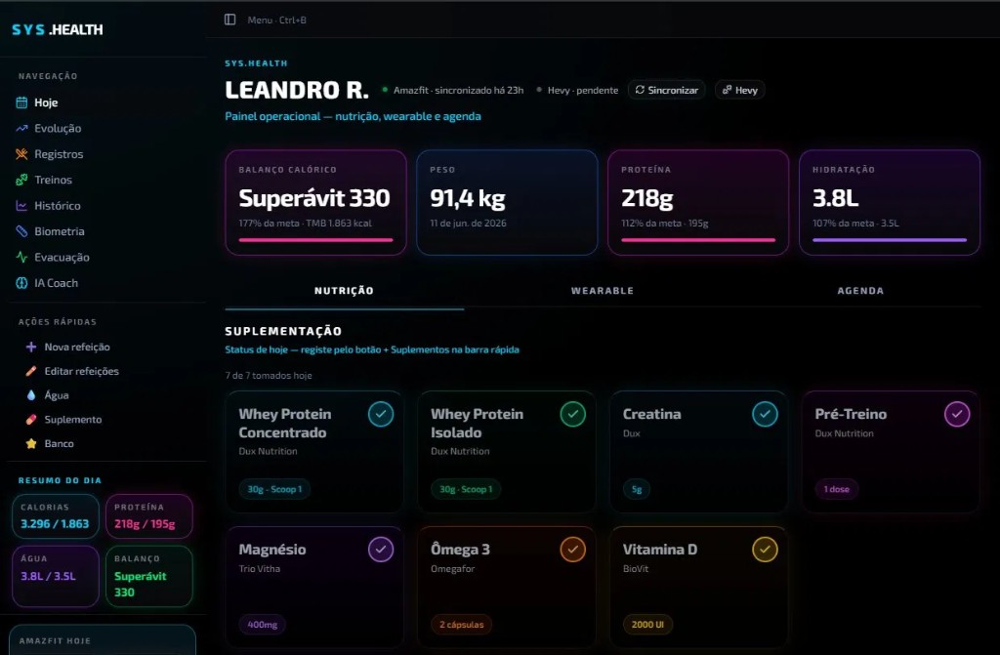

<div align="center">



<br/>

# sys-health

**PT:** Plataforma fullstack de saúde e performance pessoal — nutrição, treinos, wearable, sono e IA Coach em um único dashboard operacional.  
**EN:** Fullstack personal health and performance platform — nutrition, workouts, wearable, sleep and AI Coach in a single operational dashboard.

<br/>

[](https://nextjs.org)
[](https://react.dev)
[](https://typescriptlang.org)
[](https://tailwindcss.com)
[](https://supabase.com)
[](https://aistudio.google.com)
[](https://web.dev/progressive-web-apps)
[](https://github.com/simoesleandro/sys-health/commits)

<br/>

[🐛 Reportar bug](https://github.com/simoesleandro/sys-health/issues) &nbsp;·&nbsp;
[💡 Sugerir feature](https://github.com/simoesleandro/sys-health/issues)

</div>

---

## 📋 Índice / Table of Contents

- [Sobre](#-sobre--about)
- [Funcionalidades](#-funcionalidades--features)
- [Stack](#-stack)
- [Módulos](#-módulos--modules)
- [Integrações](#-integrações--integrations)
- [Instalação](#-instalação--setup)
- [Variáveis de Ambiente](#-variáveis-de-ambiente--environment-variables)
- [Arquitetura](#-arquitetura--architecture)
- [Testes](#-testes--tests)
- [Roadmap](#-roadmap)
- [Autor](#-autor--author)

---

## 📌 Sobre / About

**PT:**  
sys-health é uma plataforma fullstack de saúde pessoal construída com Next.js 16, React 19, TypeScript e Supabase PostgreSQL. Consolida dados de nutrição, treinos (sync Hevy), wearable (Amazfit via Zepp), sono e biometria em um único dashboard operacional com IA Coach powered by Gemini. Funciona como PWA com suporte offline.

**EN:**  
sys-health is a fullstack personal health platform built with Next.js 16, React 19, TypeScript and Supabase PostgreSQL. Consolidates nutrition, workout (Hevy sync), wearable (Amazfit via Zepp), sleep and biometrics data into a single operational dashboard with Gemini-powered AI Coach. Works as a PWA with offline support.

---

## ✨ Funcionalidades / Features

- ✅ **Dashboard operacional** — balanço calórico, peso, proteína e hidratação em tempo real
- ✅ **Nutrição** — registro de refeições, suplementos e macronutrientes diários
- ✅ **Treinos** — sync bidirecional com Hevy, histórico e análise de performance
- ✅ **Wearable** — sync automático Amazfit Bip 6 via Zepp API (passos, HRV, PAI, sono)
- ✅ **Biometria** — histórico de peso, gordura corporal e evolução visual
- ✅ **IA Coach** — análise personalizada via Gemini 2.5 Flash com contexto completo do usuário
- ✅ **Agenda** — planejamento de refeições e treinos
- ✅ **PWA** — instalável, funciona offline com service worker
- ✅ **Middleware de auth** — proteção de rotas via Supabase Auth
- ✅ **API interna** — data layer consumido pelo Hermes Lite (agente Saúde)
- 🚧 **Hevy sync automático** — em desenvolvimento (issue #1)
- 🚧 **Export PDF** — relatório de saúde mensal (issue #3)

---

## 🛠 Stack

| Camada | Tecnologia |
|--------|------------|
| Frontend | Next.js 16 · React 19 · TypeScript 5 |
| Estilo | Tailwind CSS 4 · dark theme |
| Backend | Next.js API Routes (App Router) |
| Banco | Supabase PostgreSQL (cloud) |
| Auth | Supabase Auth + middleware.ts |
| IA | Gemini 2.5 Flash (IA Coach) |
| Wearable | Zepp Cloud API (Amazfit sync) |
| Treinos | Hevy API |
| Deploy | Vercel / local porta 3535 |
| PWA | next-pwa · service worker |

---

## 📦 Módulos / Modules

| Módulo | Rota | O que faz |
|--------|------|-----------|
| **Hoje** | `/` | Dashboard principal — KPIs do dia |
| **Nutrição** | `/hoje` tab | Refeições, suplementos, macros |
| **Wearable** | `/hoje` tab | Passos, HRV, PAI, sono do dia |
| **Agenda** | `/hoje` tab | Planejamento semanal |
| **Evolução** | `/evolucao` | Gráficos de peso e macros ao longo do tempo |
| **Registros** | `/registros` | Histórico completo de refeições |
| **Treinos** | `/treinos` | Treinos Hevy com análise de performance |
| **Histórico** | `/historico` | Timeline de dados biométricos |
| **Biometria** | `/biometria` | Medidas corporais e composição |
| **Evacuação** | `/evacuacao` | Registro de saúde intestinal |
| **IA Coach** | `/ia-coach` | Chat com Gemini — análise personalizada |

---

## 🔗 Integrações / Integrations

### Supabase PostgreSQL
Banco principal — todas as tabelas de saúde, auth e dados do usuário.

### Hevy (treinos)
Sync de treinos via API Hevy — histórico de exercícios, séries, repetições e PRs.

### Amazfit / Zepp (wearable)
Sync automático diário via Zepp Cloud API — passos, HRV, PAI, sono, calorias.

### Gemini API (IA Coach)
Análise personalizada com contexto completo: nutrição do dia, treinos recentes, biometria, metas e histórico.

### Hermes Lite (data layer)
sys-health expõe API interna consumida pelo agente Saúde do Hermes Lite — permite registrar água e peso via chat de IA.

---

## 🚀 Instalação / Setup

### Pré-requisitos / Prerequisites

- Node.js 20+
- Conta Supabase (gratuita)
- Chave Gemini (gratuita em [aistudio.google.com](https://aistudio.google.com))

### Instalação / Installation

```bash
# Clone o repositório
git clone https://github.com/simoesleandro/sys-health
cd sys-health

# Instale as dependências
npm install

# Configure as variáveis de ambiente
cp .env.example .env.local
# Edite .env.local com suas chaves

# Rode em desenvolvimento
npm run dev
# → http://localhost:3535
```

---

## 🔐 Variáveis de Ambiente / Environment Variables

| Variável | Descrição | Obrigatório |
|----------|-----------|-------------|
| `NEXT_PUBLIC_SUPABASE_URL` | URL do projeto Supabase | ✅ |
| `NEXT_PUBLIC_SUPABASE_ANON_KEY` | Chave anon Supabase | ✅ |
| `SUPABASE_SERVICE_ROLE_KEY` | Chave service role (API interna) | ✅ |
| `GEMINI_API_KEY` | Gemini API (IA Coach) | ✅ |
| `HEVY_API_KEY` | Hevy API (sync treinos) | opcional |
| `ZEPP_ACCESS_TOKEN` | Zepp Cloud API (Amazfit sync) | opcional |
| `NEXT_PUBLIC_APP_URL` | URL da aplicação | opcional |

> Lista completa em: [`.env.example`](.env.example)

---

## 🏗 Arquitetura / Architecture

```
sys-health/
├── app/                    # Next.js App Router
│   ├── (auth)/             # Páginas protegidas por auth
│   ├── api/                # API Routes (data layer)
│   ├── layout.tsx          # Layout raiz + providers
│   └── middleware.ts       # Proteção de rotas Supabase Auth
├── components/             # Componentes React reutilizáveis
│   ├── dashboard/          # Cards KPI, gráficos, tabs
│   ├── nutrition/          # Refeições, suplementos, macros
│   ├── workout/            # Cards de treino Hevy
│   └── ui/                 # Design system base
├── lib/                    # Utilitários, hooks, types
│   ├── supabase/           # Client e server clients
│   ├── gemini/             # IA Coach integration
│   └── types/              # TypeScript types globais
├── public/                 # Assets estáticos + PWA manifest
└── supabase/               # Migrations e schema
```

**Fluxo de dados:**

```
Usuário → Next.js App Router
      ↓
Supabase Auth (middleware.ts)
      ↓
API Routes → Supabase PostgreSQL
      ↓
React 19 Server/Client Components
      ↓
Dashboard com dados em tempo real
```

---

## 🧪 Qualidade / Quality

```bash
# Static analysis
npm run lint

# Production build
npm run build
```

> Validação atual: ESLint limpo e build Next.js de produção concluído. Testes automatizados com Supabase ainda estão no roadmap.

---

## 🗺 Roadmap

- [x] Dashboard operacional com KPIs do dia
- [x] Nutrição — refeições, suplementos, macros
- [x] Wearable — sync Amazfit via Zepp API
- [x] Biometria — histórico e evolução visual
- [x] IA Coach com Gemini 2.5 Flash
- [x] PWA com suporte offline
- [x] Middleware de auth (middleware.ts)
- [x] API interna para Hermes Lite
- [ ] Hevy sync automático (issue #1)
- [ ] AI Coach com histórico de conversas (issue #2)
- [ ] Export PDF relatório mensal (issue #3)
- [ ] Testes Supabase (issue #4)

---

## 👤 Autor / Author

<div align="center">

**Leandro Simões**

[](https://linkedin.com/in/leandro-sim%C3%B5es-7a0b3537b)
[](https://github.com/simoesleandro)
[](https://simoesleandro.github.io/portfolio)

*Fullstack · IA Aplicada · Civic Tech*

</div>

---

<div align="center">

Feito com ☕ e IA em / Made with ☕ and AI in 🇧🇷 Rio de Janeiro

</div>
